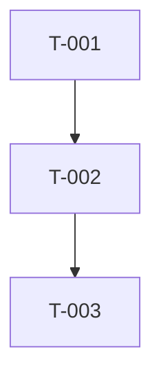

# Tasks: <feature title>

**Spec:** `specs/NNN-slug/spec.md`
**Plan:** `specs/NNN-slug/plan.md`
**Limit:** 25 tasks. Bigger features split into NNN+10 slugs.

## Tasks

- [ ] T-001 — <imperative subject>
- [ ] T-002 — ...

(max 25)

## Dependencies

## Parallelisable

- T-001 + T-002 can run in parallel
- T-003 blocks on both
