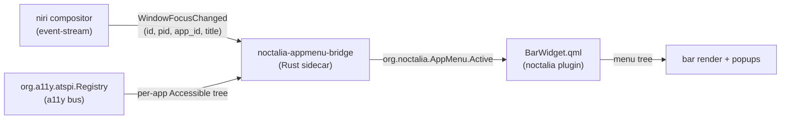

# Architecture overview

## Three layers

### 1. The accessibility substrate (out-of-tree)

The bridge walks AT-SPI accessibles to find each focused app's
menubar. AT-SPI is shipped by `at-spi2-core` and runs on its own
dedicated D-Bus instance (the "a11y bus") discovered via
`org.a11y.Bus.GetAddress()` on the session bus.

Why AT-SPI and not DBusMenu/Registrar? Qt6's auto-registration with
`com.canonical.AppMenu.Registrar` only fires when the compositor
implements `org_kde_kwin_appmenu_manager` — KWin only. niri,
Hyprland, Sway, COSMIC: none do. Result: no Qt app on niri ever
registered against the v0.2 bridge. AT-SPI works cross-toolkit,
cross-compositor, and requires no extra protocol cooperation.

See [ADR-0024](../adr/ADR-0024-atspi-substrate.md) for the substrate
decision and [`atspi.md`](./atspi.md) for the walk mechanics. The
historical DBusMenu pipeline (v0.1..v0.2) is preserved in
[`dbusmenu.md`](./dbusmenu.md) for context.

### 2. The sidecar bridge (Rust)

`noctalia-appmenu-bridge` joins three streams:

- **niri-IPC** focus events, which carry the focused window's
  `(id, pid, app_id, title)`
  ([ADR-0002](../adr/ADR-0002-no-pid-on-toplevel-use-niri-ipc.md)).
- **AT-SPI Registry root children** (one Application per a11y-aware
  process). The bridge resolves each Application's bus name to a
  PID via `GetConnectionUnixProcessID` and matches against niri's
  focused PID.
- **Per-frame menubar walk** under the matched Application,
  filtered by the focused window's title to disambiguate when one
  PID owns multiple top-level windows (Anki profile picker vs main
  window, kate "open new window")
  ([ADR-0030](../adr/ADR-0030-frame-scoped-menu-resolution.md)).

The joiner serialises the walked menu tree at the constant D-Bus
address `org.noctalia.AppMenu /org/noctalia/AppMenu/Active`
([ADR-0007](../adr/ADR-0007-fixed-proxy-vs-quickshell-pr.md)). Click
forwarding uses the AT-SPI `Action.DoAction(0)` invocation.

Trail-edge debounce: 75 ms on focus changes, 250 ms on registrar
churn ([ADR-0009](../adr/ADR-0009-debouncing-policy.md)).

Terminals, X11-under-xwayland-satellite apps, and Chrome don't
expose a menubar via AT-SPI. The bridge tracks per-`app_id` walk
outcomes and skips known-no-menubar apps to keep focus latency
under budget ([ADR-0029](../adr/ADR-0029-learned-no-menubar-skip.md)).

### 3. The QML plugin

`BarWidget.qml` subscribes to `org.noctalia.AppMenu.Active`, reads
the published menu tree, and renders one button per top-level item.
Submenus open as `PopupWindow` instances — never
`QtQuick.Controls.Menu`
([ADR-0008](../adr/ADR-0008-popup-window-for-submenus.md)).

Graceful degradation: when the bridge reports no menubar for the
focused app, the widget renders the focused app's `app_id` from
`.desktop`
([ADR-0006](../adr/ADR-0006-graceful-degradation.md)).

## What's in scope

- niri only in v1 ([ADR-0005](../adr/ADR-0005-niri-only-v1.md)).
- Qt6, GTK3/4, and any toolkit that exposes a menubar via AT-SPI
  (Anki, Okular, kate, Files, Gedit, GIMP, Inkscape, LibreOffice,
  Firefox via `widget.use-toolkit-accessibility=1`).

## What's not

- Chrome's hamburger menu (AT-SPI shape doesn't include a
  `MENU_BAR` role — the bridge's learned-skip caches the outcome
  per [ADR-0029](../adr/ADR-0029-learned-no-menubar-skip.md)).
- Multi-monitor menubar duplication.
- Alt-letter mnemonics + global Alt-F intercept
  ([ADR-0010](../adr/ADR-0010-no-keybind-intercept-v1.md)).
- Accelerator dispatch (deferred —
  [ADR-0028](../adr/ADR-0028-fr-003-accelerator-deferred.md)).
