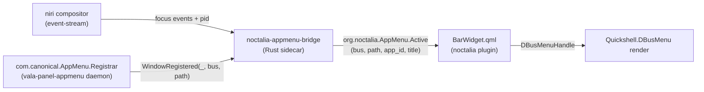

# Architecture overview

## Three layers

### 1. The registrar (out-of-tree)

A standalone implementation of `com.canonical.AppMenu.Registrar` — typically `vala-panel-appmenu`'s `appmenu-registrar` binary. Apps register their menubars here when their toolkit's appmenu module loads (`appmenu-qt5` for Qt, `appmenu-gtk-module-wayland` for GTK).

We don't host the registrar ourselves — see [ADR-0001](../adr/ADR-0001-reuse-vala-panel-appmenu-registrar.md).

### 2. The sidecar bridge (Rust)

`noctalia-appmenu-bridge` joins two streams:

- **niri-IPC** focus events, which carry the focused window's PID. ([ADR-0002](../adr/ADR-0002-no-pid-on-toplevel-use-niri-ipc.md))
- **Registrar** `WindowRegistered(windowId, bus, path)` signals. The `windowId` is X11-only and useless on Wayland; we resolve the registering process's PID via `org.freedesktop.DBus.GetConnectionUnixProcessID` instead. ([ADR-0004](../adr/ADR-0004-resolve-registrar-by-pid.md))

The joiner reduces `(focus_pid, menu_by_pid)` into an `ActiveSnapshot` and re-publishes the focused app's menu coordinates at a constant D-Bus address: `org.noctalia.AppMenu /org/noctalia/AppMenu/Active`. ([ADR-0007](../adr/ADR-0007-fixed-proxy-vs-quickshell-pr.md))

Trail-edge debounce: 75 ms on focus changes, 250 ms on registrar churn. ([ADR-0009](../adr/ADR-0009-debouncing-policy.md))

### 3. The QML plugin

`BarWidget.qml` reads the four properties off `org.noctalia.AppMenu.Active`, attaches a Quickshell `DBusMenuHandle` to the `(bus, path)` it advertises, and renders the menu tree. Submenus are `PopupWindow` instances — never `QtQuick.Controls.Menu` ([ADR-0008](../adr/ADR-0008-popup-window-for-submenus.md)).

Graceful degradation: when no menu is registered, the widget renders the focused app's `app_id` from `.desktop`. ([ADR-0006](../adr/ADR-0006-graceful-degradation.md))

## What's in scope

- niri only in v1 ([ADR-0005](../adr/ADR-0005-niri-only-v1.md))
- Qt6 and GTK3/4 client menus
- XWayland clients (registered with synthetic XID; bridge ignores it)

## What's not

- Firefox, Electron, Chromium (no DBusMenu integration upstream)
- Multi-monitor menubar duplication
- Alt-letter mnemonics + global Alt-F intercept ([ADR-0010](../adr/ADR-0010-no-keybind-intercept-v1.md))
