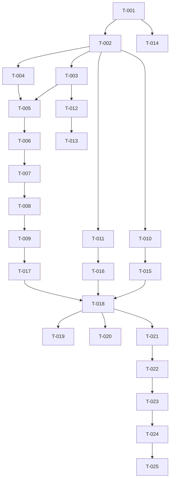

# Tasks: Global menu MVP

**Spec:** `specs/001-global-menu/spec.md`
**Plan:** `specs/001-global-menu/plan.md`
**Limit:** 25 tasks.

## Tasks

- [x] T-001 — Scaffold repo (constitution, CLAUDE.md, ADRs, workflows, sonar config)
- [x] T-002 — Bridge skeleton: `Cargo.toml` + `src/{main,config}.rs`
- [x] T-003 — Bridge: `niri.rs` event-stream consumer
- [x] T-004 — Bridge: `registrar.rs` registrar consumer + PID resolution
- [x] T-005 — Bridge: `active.rs` joiner + debounce
- [x] T-006 — Bridge: `proxy.rs` `org.noctalia.AppMenu` server
- [ ] T-007 — Plugin: `BarWidget.qml` reads active proxy props + renders fallback
- [ ] T-008 — Plugin: `MenuButton.qml` + `SubmenuPopup.qml` recursive popup
- [ ] T-009 — Plugin: integrate `DBusMenuHandle` (workaround for `QML_UNCREATABLE` if needed)
- [x] T-010 — Nix flake: `flake.nix` + `nix/module.nix`
- [ ] T-011 — Bridge unit tests: mock `niri.rs` + `registrar.rs` traits
- [ ] T-012 — Tools: `tools/fake-registrar/registrar.py` test helper
- [ ] T-013 — Integration test: niri-headless + fake registrar end-to-end
- [ ] T-014 — Wire pre-commit: `lefthook install` and verify hooks
- [ ] T-015 — Verify `nix flake check` passes
- [ ] T-016 — Verify `cargo test` passes
- [ ] T-017 — Verify `qmllint` clean
- [ ] T-018 — Initial commit + push to `yolo-labz/noctalia-appmenu`
- [ ] T-019 — Configure GH Repository Ruleset (enforcement: disabled → active after first green CI)
- [ ] T-020 — Provision Sonar project key + token + first scan
- [ ] T-021 — Register VM 103 self-hosted runner with `noctalia-appmenu` label
- [ ] T-022 — Smoke: install plugin via HM module, focus Anki, verify menubar
- [ ] T-023 — Address CI feedback (Copilot / Sonar / OSV)
- [ ] T-024 — Update CHANGELOG via git-cliff; tag v0.1.0
- [ ] T-025 — Open noctalia-plugins registry PR + Quickshell #170 follow-up

## Dependencies

## Parallelisable

- T-003 + T-004 can run in parallel (independent subsystems)
- T-007 + T-008 + T-011 can run in parallel after T-006
- T-019 + T-020 + T-021 can run in parallel after T-018
