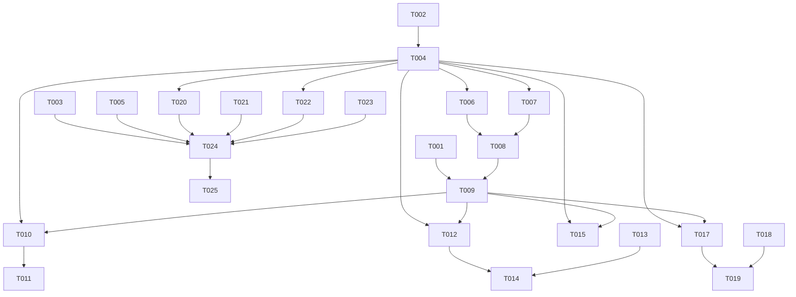

# Tasks: project completion roadmap (v0.3.0 → v1.0.0)

**Spec:** `specs/004-project-completion/spec.md`
**Plan:** `specs/004-project-completion/plan.md`
**Limit:** 25 tasks (constitution Development Workflow §3). Per-lane granular work lives in child sub-specs `005-008`.

> **Tasks here are *coordination* tasks** — dispatching child specs, merging the right things in the right order, gating on the right tests. The granular code work lands in `specs/005-bridge-completion/tasks.md`, `specs/006-plugin-completion/tasks.md`, `specs/007-nix-completion/tasks.md`, and `specs/008-ci-quality-docs/tasks.md` (each ≤ 25 tasks of its own).

## User-story → priority mapping

| Story | Scenario in spec.md | Priority | MVP? |
|---|---|---|---|
| US1 | Fresh-NixOS install delivers Anki menubar in the bar | P1 | yes |
| US2 | Focus tracking between three real Qt6 apps | P2 | no |
| US3 | Nested submenu navigation | P2 | no |
| US4 | Checkable menu items render correctly | P3 | no |
| US5 | AT-SPI bus crash + restart recovery | P3 | no |
| US6 | niri compositor reload recovery | P3 | no |
| US7 | Reproducible release artefact verifies on a fresh box | P3 | no |

## Phase 1 — Setup

- [ ] T001 Triage open Dependabot PRs (#64–72) per `research.md` §4 — merge safe patches (#65/#66/#69/#71), review minors (#67/#70/#72), defer majors (#64/#68) at `https://github.com/yolo-labz/noctalia-appmenu/pulls`
- [ ] T002 [P] Open umbrella spec PR for `004-project-completion` for review-only (no code), capture sign-off in `https://github.com/yolo-labz/noctalia-appmenu/pulls/new/004-project-completion`
- [ ] T003 [P] Evaluate whether FR-027 cognitive-complexity refactor lands in v1.0.0 or is deferred via ADR-0025 — write decision into `docs/adr/ADR-0025-cognitive-complexity-waiver.md` if deferred, otherwise close this task as N/A

## Phase 2 — Foundational (blocking prerequisites for all stories)

- [ ] T004 Create child sub-spec scaffolds — `specs/005-bridge-completion/`, `specs/006-plugin-completion/`, `specs/007-nix-completion/`, `specs/008-ci-quality-docs/` — each with `spec.md` derived from the relevant FR cluster in `specs/004-project-completion/spec.md`
- [ ] T005 Draft the v1.0.0 Repository Ruleset required-checks list per `specs/004-project-completion/contracts/ci-required-checks.md` and stage as a PR against `.github/rulesets/main.json` (enforcement = disabled until all checks exist; flip at T024)

## Phase 3 — US1 Fresh-NixOS install delivers Anki menubar (P1, MVP)

**Independent test:** boot a fresh NixOS host, follow `specs/004-project-completion/quickstart.md` §1–§4, observe Anki's menu strip render in the noctalia top bar within ≤ 200 ms of focus.

- [ ] T006 [US1] Dispatch Lane A worker — implements FR-001..FR-008 against `bridge/src/{focus,niri,atspi}.rs` per `specs/005-bridge-completion/tasks.md`; worker writes to `../noctalia-appmenu-73-bridge-completion/` worktree, branches off `origin/main`, opens PR after self-test
- [ ] T007 [P] [US1] Dispatch Lane C worker — implements FR-014..FR-016 + FR-020 against `nix/module.nix` per `specs/007-nix-completion/tasks.md`; worker writes to `../noctalia-appmenu-75-nix-completion/` worktree, branches off `origin/main`, opens PR after self-test
- [ ] T008 [US1] Verify Lane A + Lane C PRs locally — apply both to a `nh os switch` host, run `quickstart.md` §1–§4 manually, capture `journalctl --user -u noctalia-appmenu-bridge.service` evidence
- [ ] T009 [US1] Merge Lane A + Lane C PRs after T008 sign-off via `gh pr merge --squash --delete-branch`

## Phase 4 — US2 Focus tracking between three real Qt6 apps (P2)

**Independent test:** with Anki + kate + dolphin running, Mod+Tab between them; each app's menubar appears in the bar within ≤ 200 ms; no flicker propagates to neighbouring widgets.

- [ ] T010 [US2] Dispatch Lane B worker for FR-013 (multi-screen popup routing) + the BarWidget side of FR-011/FR-012 — worker writes to `../noctalia-appmenu-74-plugin-completion/` worktree
- [ ] T011 [US2] Manual smoke per Scenario 2 of `specs/004-project-completion/spec.md` on the desktop host; sign off in the Lane B PR description

## Phase 5 — US3 Nested submenu navigation (P2)

**Independent test:** focus kate, open `File → Open Recent…`; the submenu renders to the right of the parent row; clicking a leaf activates the AT-SPI action and closes both popups.

- [ ] T012 [P] [US3] Lane B worker creates `plugin/SubmenuPopup.qml` per `specs/004-project-completion/contracts/submenu-popup-component.md`; wires the `hasChildren` click in `plugin/AppmenuPopupWindow.qml:240` to open the new popup; includes a QML fixture test under `plugin/tests/qmltest/submenu_popup.qml`
- [ ] T013 [P] [US3] Lane A worker implements click-path re-fetch (FR-007) — `do_action` in `bridge/src/atspi.rs:815–837` re-fetches the addressed accessible before invoking `DoAction(0)`, returns typed `MenuError::Stale` on path-not-found
- [ ] T014 [US3] End-to-end smoke per Scenario 3 (kate `File → Open Recent`) once both T012 + T013 land; sign off in the relevant PR descriptions

## Phase 6 — US4 Checkable menu items + icons (P3)

**Independent test:** focus kate, open `Tools → Spelling`; checked items show a visible indicator; unchecked items show an empty slot at consistent alignment; icon-themed items render their freedesktop icon.

- [ ] T015 [P] [US4] Lane B worker implements `toggle_state` rendering (FR-011) in the popup row delegate of `plugin/AppmenuPopupWindow.qml` and `plugin/SubmenuPopup.qml`; add to the shared `MenuRow.qml` component if the worker extracts one
- [ ] T016 [P] [US4] Lane B worker implements `icon_name` rendering (FR-012) via Qt's icon-theme lookup; verify against Catppuccin Mocha tinting; renders no leading space when `icon_name` is empty

## Phase 7 — US5 + US6 Bus + niri restart recovery (P3)

**Independent test US5:** kill `at-spi-bus-launcher`, wait for D-Bus reactivation, focus a Qt6 app; the bridge re-flips `org.a11y.Status.IsEnabled = true` and resumes publishing menus within ≤ 5 s. **Independent test US6:** `niri msg reload-config` while a Qt6 app is focused; the bridge reconnects with floor-level backoff and the menubar restores within ≤ 2 s.

- [ ] T017 [P] [US5] Lane A worker subscribes to `org.a11y.Status` `PropertiesChanged` in `bridge/src/atspi.rs` per FR-005, re-invokes `enable_a11y()` on `IsEnabled = false`; persistent a11y connection per FR-006
- [ ] T018 [P] [US6] Lane A worker implements backoff reset (FR-001) and integration test (FR-002) for the niri ack-path in `bridge/src/niri.rs` + new `bridge/tests/niri_reconnect.rs`
- [ ] T019 [US5][US6] End-to-end smoke for Scenarios 5 + 6; manual on the desktop host; capture `journalctl` evidence; sign off in Lane A PR

## Phase 8 — US7 Reproducible release artefact verification (P3)

**Independent test:** `gh attestation verify ./noctalia-appmenu-bridge --owner yolo-labz` returns success against the v1.0.0 candidate artefact; the attached SBOM is CycloneDX 1.7 + SPDX 2.3; `nix build` produces a byte-identical binary on a second invocation.

- [ ] T020 [P] [US7] Lane D worker fixes CycloneDX `1.6 → 1.7` in `.github/workflows/release.yml:77` per FR-021; the attestation claim now matches the emitted document
- [ ] T021 [P] [US7] Lane D worker adds the `reproducibility` job per FR-019 to `.github/workflows/ci.yml`; builds the bridge twice, asserts byte-identical output; FR-018 source-of-truth `version` derivation reads from `bridge/Cargo.toml`

## Phase 9 — Polish & cross-cutting concerns

- [ ] T022 [P] Lane D worker adds the AT-SPI integration job per FR-022 to `.github/workflows/ci.yml`; runs `bridge/tests/atspi_integration.rs` (fake-AT-SPI-registry harness from Lane A) on every PR
- [ ] T023 [P] Lane D worker adds qmllint SARIF emit + upload per FR-024 to `.github/workflows/ci.yml`; covers all `plugin/*.qml`; uploaded via `github/codeql-action/upload-sarif`
- [ ] T024 Flip the Repository Ruleset on `main` from "enforcement = disabled" to "enforcement = active" once T005's check list is satisfied by all required jobs; required checks per `specs/004-project-completion/contracts/ci-required-checks.md`
- [ ] T025 Tag `v1.0.0` after SC-001..SC-008 all pass on `main`; `git-cliff` regenerates `CHANGELOG.md`; release workflow publishes the artefact + SBOMs + attestation; verify with `gh attestation verify` on the published binary

## Dependencies

## Parallelisable batches

- **Batch 1 (Phase 1):** T001 + T002 + T003 run in parallel.
- **Batch 2 (Phase 3, MVP):** T006 (Lane A) + T007 (Lane C) in parallel; both feed T008 → T009.
- **Batch 3 (after T009 merges):** T010 (Lane B FR-013), T012 (Lane B SubmenuPopup), T015 (Lane B toggle), T016 (Lane B icon), T017 (Lane A IsEnabled monitor), T018 (Lane A niri backoff), T020 (Lane D CDX), T021 (Lane D reproducibility), T022 (Lane D AT-SPI integration job), T023 (Lane D qmllint SARIF) all run in parallel — file-collision-free per `specs/004-project-completion/plan.md` §Affected files.
- **Batch 4 (final):** T024 blocks on T005 + every job that adds to the required-checks set. T025 blocks on T024.

## Implementation strategy

1. **MVP (US1 only) is shippable as `v0.4.0`** — Anki menubar in the bar on a fresh-NixOS install. Tag `v0.4.0` after T009 merges. This proves the Lane A + Lane C dispatch + review loop end-to-end before committing the rest of the budget.
2. **Incremental P2 (US2 + US3) lands as `v0.5.0`** — multi-app focus + nested submenus. Tag once Phase 5 is green.
3. **P3 polish (US4..US7) lands as `v0.6.0`..`v0.9.0` rolling beta tags** — each P3 story can release independently once green. No coupling between US5 and US7.
4. **`v1.0.0` final** — when all of SC-001..SC-008 pass on `main`. No re-tagging on defects (constitution); `v1.0.1` follows.

## Parent-side oversight obligations (not numbered tasks — they are continuous)

- Every worker session writes its own `tasks.md` (≤ 25 items) in its child sub-spec dir.
- Every worker session pushes to its own feature branch; the parent reviews + opens the PR.
- Every worker session reports completion via stream-json + a final summary in the PR description.
- Parent kills any worker that exceeds 80 turns without a commit or breaches its `--max-budget-usd` cap.
