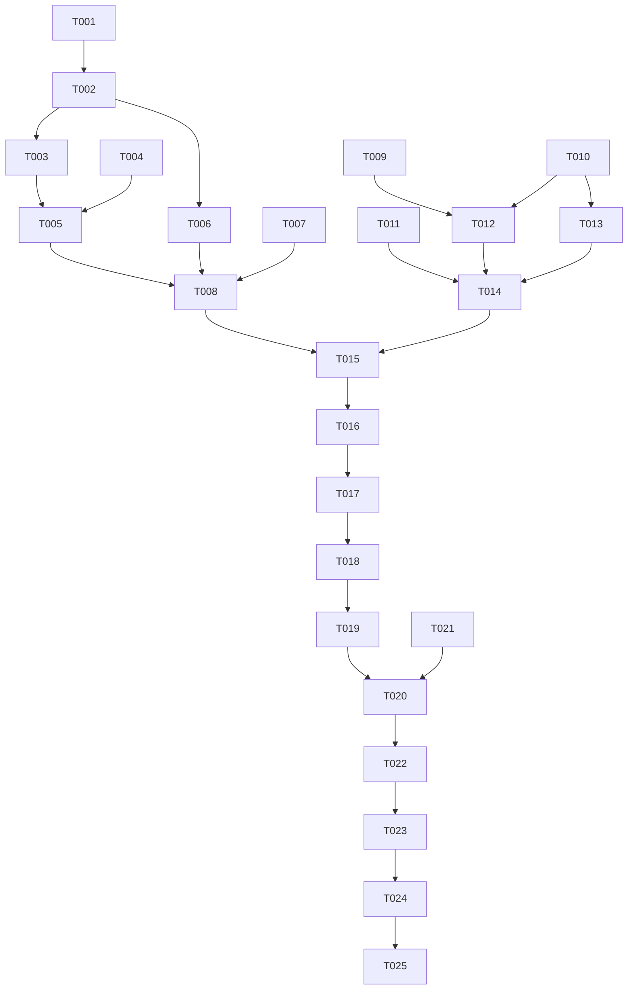

# Tasks: v1.0.0 popup hotfix — submenu cascade + render fidelity

**Spec:** `specs/009-popup-hotfix/spec.md`
**Plan:** `specs/009-popup-hotfix/plan.md`
**Limit:** 25 tasks (constitution Development Workflow §3).

> **Single combined PR** (hotfix speed). Bridge + plugin fixes ship together as `fix(v1.0.1): popup hotfix — recursive flatten + popup geometry`. Tasks below are per-file granular; CI cycle is one round.

## User-story → priority mapping

| Story | Scenario | FR coverage | Priority |
|---|---|---|---|
| US1 — depth-3 cascade renders real labels | Spec §Scenarios 1+2 | FR-001, FR-003, FR-004 | P1 |
| US2 — bar stays clickable while popup open | Spec §Scenarios 3 | FR-002 | P1 |
| US3 — model invalidates after Stale refresh | Spec §Scenarios 4 | FR-005 | P2 |
| US4 — multi-screen guard not false-positive | (implicit, multi-monitor) | FR-006, FR-007 | P3 |
| US5 — failed-state self-heals | Spec §Scenarios 5 | FR-008 | P3 |

## Phase 1 — Setup (worktree + version bump)

- [ ] T001 Confirm worktree at `~/Documents/Code/yolo-labz/noctalia-appmenu-009-popup-hotfix`, branch `009-popup-hotfix`, tracking `origin/main`. `git status` clean modulo planned edits.
- [ ] T002 Bump `bridge/Cargo.toml` `version = "1.0.0" → "1.0.1"`. Bump `Cargo.lock` via `cargo update -w` inside the bridge crate.

## Phase 2 — Bridge (Lane B) — FR-001 + FR-006 produce-side

- [ ] T003 [P] [US1] Edit `bridge/src/atspi.rs` `fetch_menu_tree`: extract the wrapper-flatten block (lines 801–811) into a `pub(crate) fn flatten_qt_wrapper(item: &mut MenuItem)` helper; invoke it on each child immediately after the recursive `fetch_menu_tree` returns and BEFORE pushing into the parent's `children`. Keep the existing top-level call as a no-op double-check.
- [ ] T004 [P] [US1] Add fixture `bridge/tests/fixtures/qt_nested_wrapper.json` mirroring the shadPS4QtLauncher `View > Game List Mode > [List, Grid, Flat]` shape with the unnamed-MENU wrapper at depths 1, 2, 3.
- [ ] T005 [US1] Add `bridge/tests/atspi_flatten.rs` round-trip test: load the fixture, run `flatten_qt_wrapper` on each item bottom-up, assert post-flatten tree contains zero empty-label MENU intermediates and the expected leaf labels at every depth. Include the four edge cases (multi-child wrapper rejected, nested wrapper handled, empty leaf untouched, toggle preserved).
- [ ] T006 [P] [US4] Edit `bridge/src/active.rs` `ActiveSnapshot` struct: add `focused_output: Option<String>` with `#[serde(skip_serializing_if = "Option::is_none")]`. Wire from focus event payload.
- [ ] T007 [P] [US4] Edit `bridge/src/focus.rs`: surface focused output's `name` from niri-IPC focus event to the snapshot writer (extend the existing focus state struct with `focused_output: Option<String>` accessor).
- [ ] T008 Run `cargo test -p noctalia-appmenu-bridge --all-targets` AND `cargo clippy -p noctalia-appmenu-bridge -- -D warnings` AND `nix flake check .`. All green.

## Phase 3 — Plugin (Lane Q) — FR-002..005, FR-006 consume, FR-007, FR-008

- [ ] T009 [P] [US2] Edit `plugin/AppmenuPopupWindow.qml`:
  - Drop `anchors.bottom: true` and `anchors.right: true` (keep top + left).
  - Set `width: menuBox.width` and `height: menuBox.height`.
  - Replace `mapToItem(null, 0, 0)` calls with `mapToGlobal(0, 0)` for `x`/`y` derivation.
  - Remove the full-screen outside-click `MouseArea` (rely on focus-shift / leaf-click / bar-button-click for dismissal).
  - Bind `menuBox.width` to `Math.max(180, popupCol.childrenRect.width + Style.marginM * 2)`.
  - Drop `popupCol`'s `anchors.left` + `anchors.right`; let it size to children.
- [ ] T010 [P] [US1][US2] Edit `plugin/SubmenuPopup.qml`:
  - Same surface fixes as T009 (drop full-screen anchors, sizing, mapToGlobal, remove full-screen MouseArea, fix `submenuCol` width binding).
  - Add `property int depth: 1`.
  - Bind `WlrLayershell.namespace` to `"noctalia-appmenu-submenu-d" + depth + "-" + (screen ? screen.name : "unknown")`.
  - In the recursive `nestedComponent`, set `depth: parent.depth + 1` (or rather pass via the parent's `depth + 1`; QML cannot read parent across Component boundary so pass via the binding before `open`).
  - In the `submenuRequested` handler, replace immediate `nestedLoader.item.open(...)` with a `Loader.status === Loader.Ready` check + `Connections { target: nestedLoader; function onStatusChanged() { ... } }` listener that fires `open()` once on the first `Ready` transition.
- [ ] T011 [P] [US3] Edit `plugin/BarWidget.qml`:
  - Extend `_sameTopLevel(a, b)` to also compare `a[i].children.length` against `b[i].children.length` AND first-level child labels (length + per-index label match).
  - Wire `focusedScreenName` to consult `_lastSnapshot.focused_output` as a fallback between the existing Quickshell try and the empty-string default.
  - Extract `_failedState` clear into `_clearFailedStateIfRecovered()` helper. Invoke at end of every successful `_applySnapshotInner`. Also invoke on `applySnapshot(null)` to drop the latch on explicit clears.
- [ ] T012 [US1][US2] Add `plugin/tests/qmltest/popup_geometry.qml`: instantiate `AppmenuPopupWindow` with mock anchor; assert `popup.x ≈ 100`, `popup.y ≈ 32 + barBtnH`, `popup.width === menuBox.width < screenWidth`, `popup.height === menuBox.height < screenHeight`. Mirror the existing `submenu_popup.qml` harness pattern.
- [ ] T013 [US1] Add `plugin/tests/qmltest/submenu_cascade.qml`: synthesise a depth-3 menu tree, drive the cascade open, assert each `SubmenuPopup` at every depth is `visible == true` AND each `WlrLayershell.namespace` matches the depth-suffixed pattern.
- [ ] T014 Run `qmllint plugin/` (clean) AND any existing qmltest invocation in CI (`make qmltest` if present, else direct `qmltestrunner -input plugin/tests/qmltest/`). All green.

## Phase 4 — Combined PR + CI

- [ ] T015 Stage commit per lane:
  - `git add -- bridge/ Cargo.lock` then `git commit -s -m "fix(bridge): recursive Qt menu flatten + emit focused_output (#009)"`
  - `git add -- plugin/` then `git commit -s -m "fix(qml): popup geometry, cascade, dedup, namespace (#009)"`
- [ ] T016 `git fetch origin main && git rebase origin/main`. Verify `git log origin/main..HEAD --oneline` shows ONLY the two new commits.
- [ ] T017 `git push -u origin HEAD` from the worktree.
- [ ] T018 `gh pr create --title "fix(v1.0.1): popup hotfix — recursive flatten + popup geometry" --body "..."` with body referencing spec 009, FR list, SC list, test plan checkboxes.
- [ ] T019 `gh pr checks <PR> --watch` until all required checks green; address any lint / format / commitlint failures via the PR-correction sub-flow.

## Phase 5 — Merge + release

- [ ] T020 `gh pr merge <PR> --squash --delete-branch` after CI green and after Pedro signs off (or after T021 manual smoke confirms SC-001..003).
- [ ] T021 Pre-merge manual smoke against `shadPS4QtLauncher` from the worktree's local build:
  - `cargo build --release -p noctalia-appmenu-bridge` (NOT installed, just checking compile)
  - `qs -c noctalia-shell ipc reload` after editing `~/.config/noctalia/Settings.json` widget settings if needed
  - Open shadPS4QtLauncher → click View → assert SC-001 (full-width labels visible)
  - Hover Game List Mode → assert SC-002 (cascade renders real labels)
  - With View open, click Settings on bar → assert SC-003 (popup transitions in one click)

## Phase 6 — Tag + release-engineering verification

- [ ] T022 From the main worktree on `main`: `git fetch origin main && git pull --ff-only origin main`. Tag `v1.0.1` with `git tag -s v1.0.1 -m "v1.0.1 — popup hotfix (spec 009)"`. Push: `git push origin v1.0.1`.
- [ ] T023 Wait for release workflow (`gh run watch <id>`) on the self-hosted runner. Verify all six artefacts attached + `gh attestation verify ./noctalia-appmenu-bridge-linux-x86_64 --repo yolo-labz/noctalia-appmenu` exits 0 (SC-008).

## Phase 7 — Deploy + SC verification

- [ ] T024 `cd ~/NixOS && nix flake update noctalia-appmenu && nh os switch .` to deploy v1.0.1 to Pedro's desktop. Confirm bridge service restart + new version active via `noctalia-appmenu-bridge --version`.
- [ ] T025 Run SC-001..006 verification matrix on actual desktop. Save memory file `project_v1_0_1_shipped.md` with findings + tally.

## Dependencies

## Parallelisable

- Phase 2 (Bridge): T003, T004, T006, T007 all parallel (different files / additive)
- Phase 3 (Plugin): T009, T010, T011 mostly parallel (different files; T011 imports nothing from T009/T010)
- Phase 2 + Phase 3 fully parallel — independent file sets
- Phase 4..7 strictly sequential
